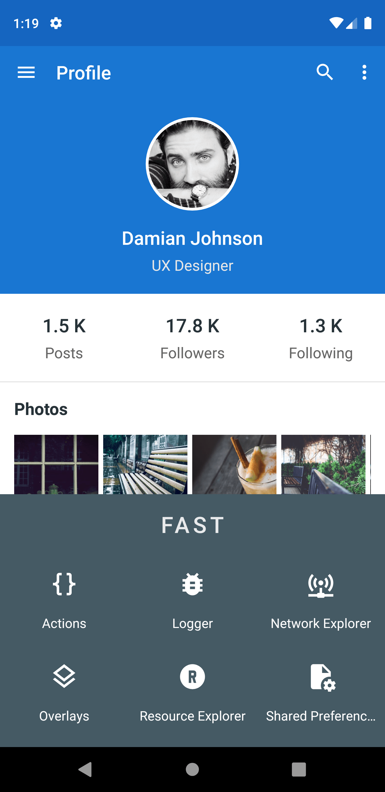
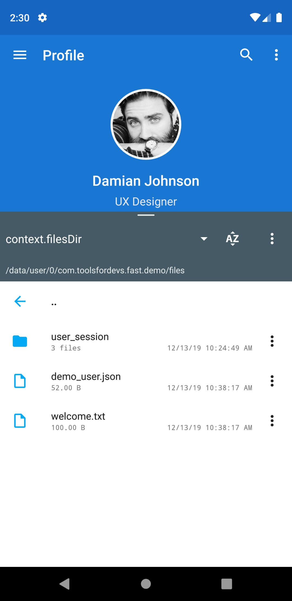
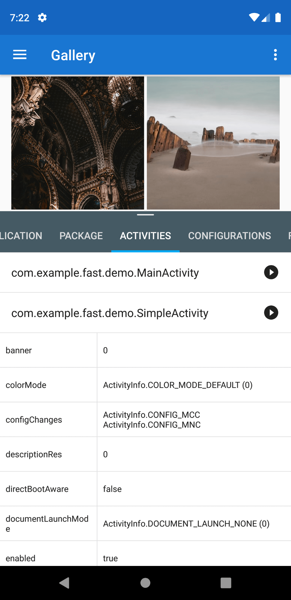
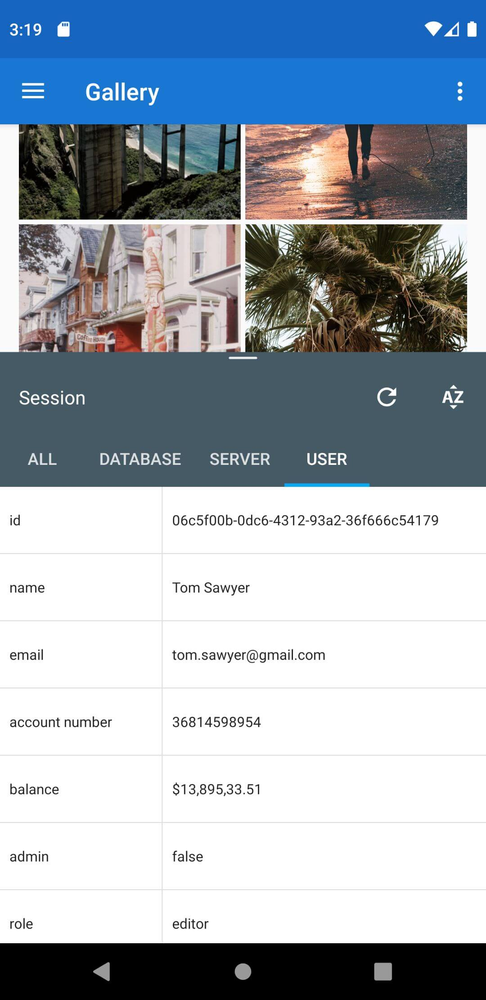
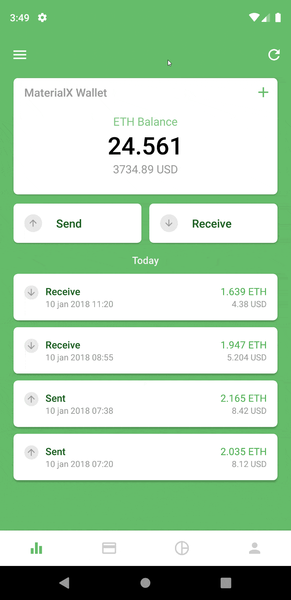
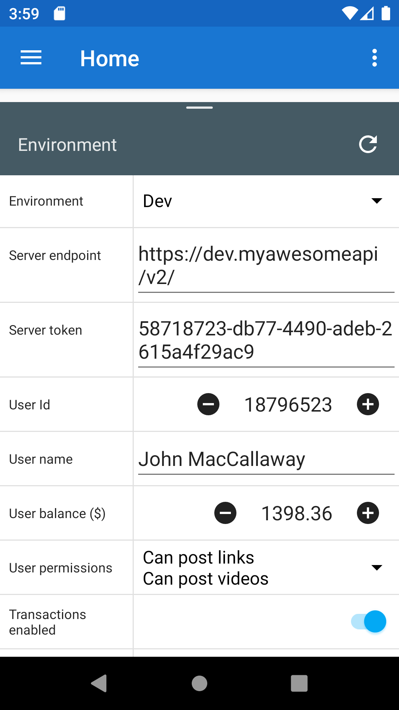

> Simple tools. BIG IMPACT.

Would you say that *Android development* is rather **EASY** - or - ***PAINFUL***?

Unfortunately, we all know the answer (and it's not the 4-letter one).

SO LET US **HELP** YOU WITH SOME **SIMPLE**, **TIME-SAVING TOOLS**.

# Public repository of FAST SDK for Android
**The First Android Tooling Framework Designed Specifically For Android Developers.**

*Demo project coming soon*

Head over the wiki for more information or check out our website https://www.fast-sdk.com

Current status : **Beta**  
Last version : **0.9.8**  
Number of tools: **14**

Please read the [Wiki](https://github.com/ToolsForDevs/FAST-SDK-Android/wiki/First-steps) for documentation on integration.

## What is FAST SDK?
Well, think of it as a magic toolbox for Android developers. For every problem, FAST has a tool to help you with the issue.
And if it doesn't have the tool to your problem, well, you can build your own easily.

**[Presentation video](https://www.youtube.com/watch?v=d_KzA5wDB10)**

Its modularity allows you to include in your project only the tools you need. Each tool comes as a dependency, like any third-party library.

The tools are only usable in the Android app (e.g not in your IDE, browser, or as a separate software). They are displayed in your Android app, over your activity’s layout. Rest assured, thanks to some magic, your layouts **ARE NOT** modified.

In order to be compatible with and integrated in as many projects as possible, FAST SDK do not rely on the androidx (nor the old appcompat) libraries or any third party library. This way, we can ensure that there will be no dependency conflicts with other libraries.

FAST SDK is a framework. While one of the primary objective is to provide UI tools for Android developers, an equally important objective is to offer a way for Android developers to create their own tools quickly and simply.

*While we don’t provide any documentation for creating your own tools during the beta phase (as we’re focused on making the first batch of tools), it will be available once the public beta is over.*

That is why FAST SDK has been designed form the beginning with extension and customization in mind. We want to offer the possibility to any Android developer to create their own tool(s) on top of our framework, or create extensions to existing tools.

We have defined two main components:
* Plugins : Plugins are the tools themselves, that can be used in the Android application
* Extensions : Extensions are a quick and easy way to add functionality to plugins. For example:
  * an extension to support custom widgets in the View Inspector plugin
  * an extension to support custom objects formatting in the Logger plugin
  * an extension to support a networking library in the Network Inspector plugin
  * an extension to define custom actions in the Actions plugin
* Shared features : Shared features are feature modules you can depend on to build your custom plugins.

FAST SDK is written in Kotlin, and will try its best to be compatible with Java (for developers).

## Current available plugins

Actions | Crash Info | File Explorer
------- | ---------- | ------------- 
 |  | 
Use the power of lambdas to execute any piece of code with or without parameters | Instantaneously get data about a crash, and decide what to do after that (restart app, restart activity, clear data, ignore the crash and continue) | Explore your app’s private data folders, as well as other directories on the device
[Video](https://www.youtube.com/watch?v=F962GEgVUOY) | [Video](https://www.youtube.com/watch?v=zYuKsefqR7U) | 

Logger | Manifest Explorer | Network Inspector
------ | ----------------- | ----------------- 
 |  | 
A very powerful Logcat  | An easy way to explore your app’s manifest and package content. You can even start activities and services! | Visualize you network requests (headers, body, ...)

Overlays | Resource Explorer | Restart Options
-------- | ----------------- | --------------- 
 |  | 
Display visual information on your views like size, margins, paddings, positions, ... as well as pixel grids and rulers |  View your app’s resources like colors, dimensions, drawable and strings |  Quickly kill or restart your app or activity (and clear app data if you need to)
&nbsp; | **[Video](https://www.youtube.com/watch?v=8geHl8vYMFM)** | 

SharedPreferences Editor | Session Manager | View Inspector
------------------------ | --------------- | --------------
 |  | 
Visualize and edit your SharedPreferences |  Visualize your app’s important variables to check you app’s state at any moment | Live edit your views and layouts
&nbsp; | &nbsp; | **[Video](https://www.youtube.com/watch?v=urumZQpa83I)**

Window Flags | Environment Switch | ...
------------ | ------------------ | ---
 |  | &nbsp;
Customize your Window’s flags, along with the status and navigation bars | An easy way to switch between your app's custom environments | &nbsp;
