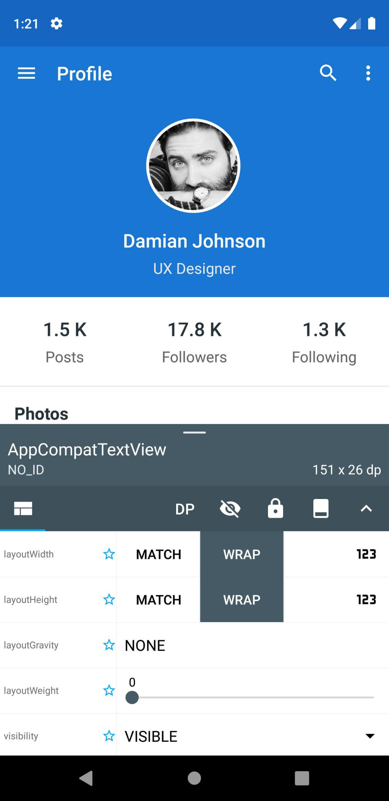
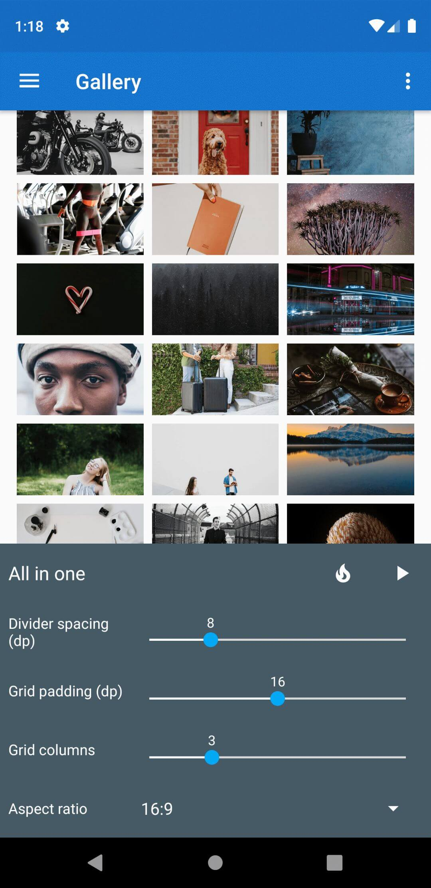
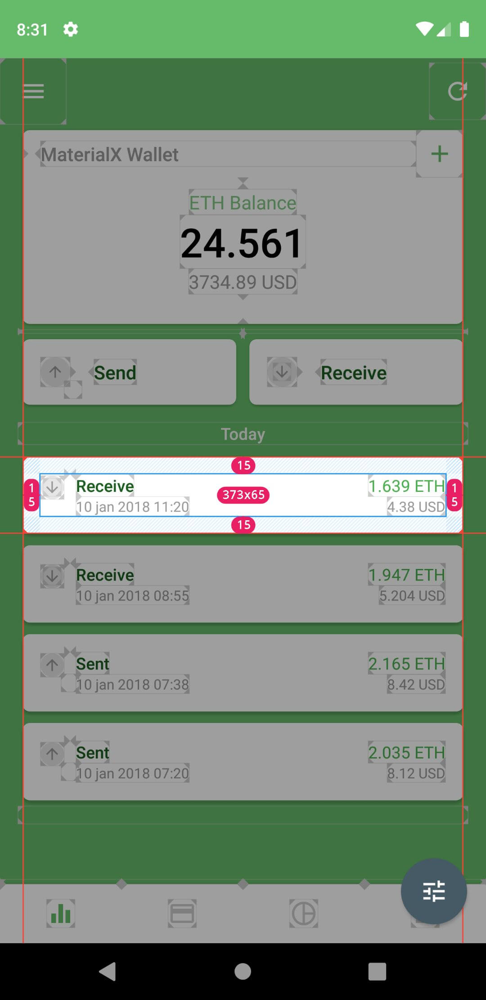
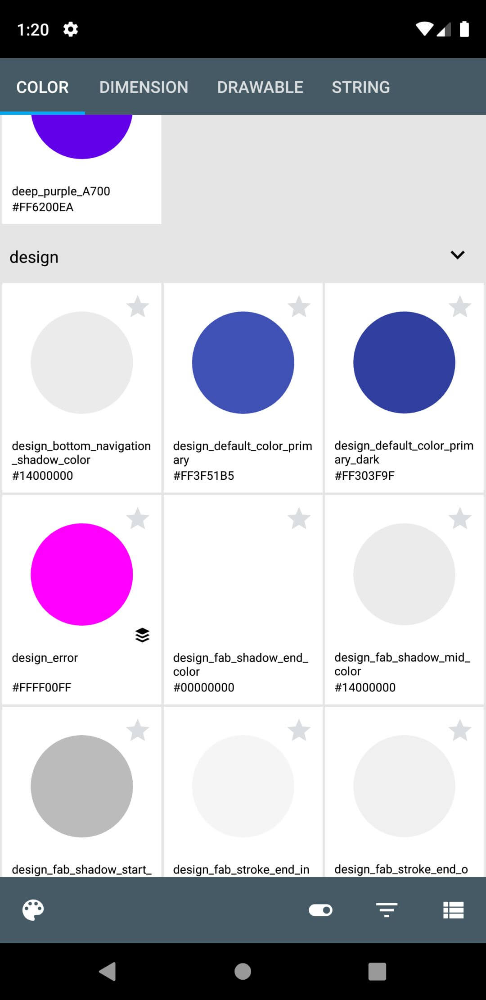
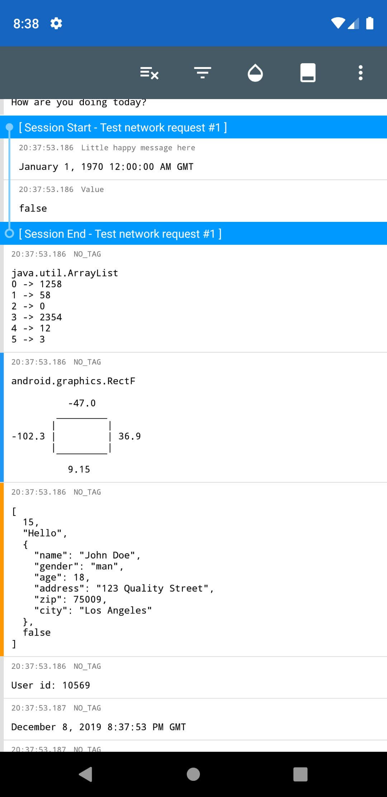
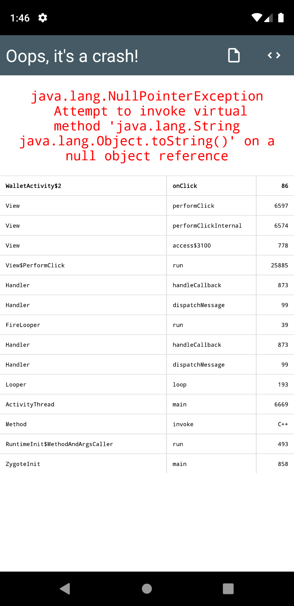
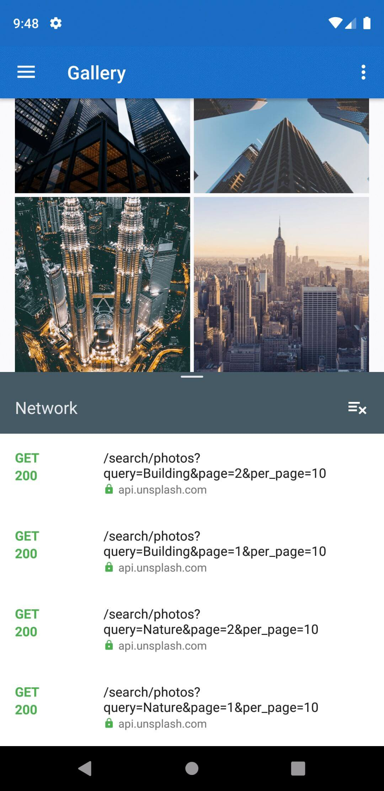

> BUILDING THE FUTURE OF ANDROID TOOLS FOR DEVELOPERS.

# Public repository of FAST SDK for Android

Demo project coming soon

Head over the wiki for more information or check out our website https://www.fast-sdk.com

Current status : **Beta**
Last version : **0.8.8**

Please read the [Wiki](https://github.com/ToolsForDevs/FAST-SDK-Android/wiki/First-steps) for documentation on integration.

## What is FAST SDK?
FAST SDK is a framework of UI tools for Android developers. In order to avoid any surprise quickly: FAST SDK **IS NOT FREE**, nor open source.

**[Presentation video](https://www.youtube.com/watch?v=d_KzA5wDB10)**

Its modularity allows you to include in your project only the tools you need. Each tool comes as a dependency like any third-party library.

The tools are only usable in the Android app (e.g not in your IDE, browser, or as a separate software). They are displayed in your Android app, over your activity’s layout. Rest assured, thanks to some magic, your layouts **ARE NOT** modified.

In order to be compatible with and integrated in as many projects as possible, FAST SDK do not rely on the androidx (nor the old appcompat) libraries or any third party library. This way, we can ensure that there will be no dependency conflicts with other libraries.

FAST SDK is a framework. While one of the primary objective is to provide UI tools for Android developers, an equally important objective is to offer a way for Android developers to create their own tools quickly and simply.

*While we don’t provide any documentation for creating your own tools during the beta phase (as we’re focused on making the first batch of tools), it will be available once the public beta is over.*

That is why FAST SDK has been designed form thebeginning with extension and customization in mind. We want to offer the possibility to any Android developer to create its own tool(s) on top of our framework, or create extensions to existing tools.

We have defined two main components:
* Plugins : Plugins are the tools themselves, that can be used in the Android application
* Modules : Modules are extensions for plugins. For example:
  * a module to support custom widgets in the View Inspector plugin
  * a module to support custom objects formatting in the Logger plugin
  * a module to support a networking library in the Network Inspector plugin
  * a module to define custom actions in the Actions plugin

FAST SDK is written in Kotlin, and will try its best to be compatible with Java (for developers).

## Current available plugins
Name | Description | Preview
---- | ----------- | -------
View Inspector | Live edit your views and layouts | **[Video](https://www.youtube.com/watch?v=urumZQpa83I)**    
Actions |Use the power of lambdas to execute any piece of code with or without parameters | **[Video](https://www.youtube.com/watch?v=F962GEgVUOY)**   
Overlays | Display visual information on your views like size, margins, paddings, positions, ... as well as pixel grids and rulers | 
Resource Explorer | View your app’s resources like colors, dimensions, drawable and strings | **[Video](https://www.youtube.com/watch?v=8geHl8vYMFM)**   
Logger | A very powerful Logcat | 
Crash Info | Instantaneously get data about a crash, and decide what to do after that (restart app, restart activity, clear data, ignore the crash and continue) | **[Video](https://www.youtube.com/watch?v=zYuKsefqR7U)**   
SharedPreferences Editor | Visualize and edit your SharedPreferences | 
Network Inspector | Visualize you network requests (headers, body, ...) | 

